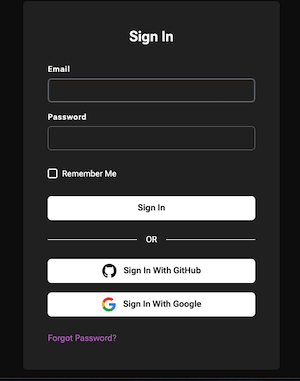
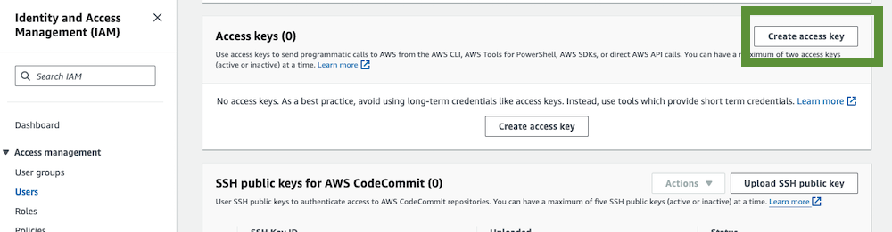

## Datastax AI stack (AWS) without a custom domain

## Table of contents

1. [Overview](#1-overview)
2. [Installation and Prerequisites](#2-installation-and-prerequisites)
3. [Setup](#3-setup)
4. [Deployment](#4---deployment)
5. [Cleanup](#5---cleanup)

## 1. Overview

### 1.1 - About this module

Terraform module which helps you quickly deploy an opinionated AI/RAG stack to your cloud provider of choice, provided by Datastax.

It offers multiple easy-to-deploy components, including:
 - Langflow
 - Astra Assistants API
 - Vector databases

### 1.2 - About this example

This example uses the AWS variant of the module, and allows you to deploy langflow/assistants easily using ECS on Fargate, without
any custom domain necessary.

There are, unfortunately, some catches to this specific deployment path, as attempting to deploy on AWS without a custom domain runs into
some limitations of the architecture we've chosen. To work around these, there will be two drawbacks (that may be eliminated with a custom domain):
- Each domain-less component will have a unique ALB in front of it, instead of sharing a single ALB like the components using a custom domain.
- These components will be served over less secure `http` instead of `https`
  - (If using langflow, you may need to apply [this](https://github.com/langflow-ai/langflow/issues/1508) issue workaround)

## 2. Installation and Prerequisites

### 2.1 - Terraform installation

You will, of course, need to install the Terraform CLI to use Terraform. Follow the steps below to install it, if you still need to.

- ✅ `2.1.a` Visit the Terraform installation page to install the Terraform CLI

https://developer.hashicorp.com/terraform/install

- ✅ `2.1.b` After the installation completes, verify that Terraform is installed correctly by checking its version:

```sh
terraform -v
```

### 2.2 - Astra token w/ sufficient perms

Additionally, you'll need a Datastax AstraDB token to enable creation and management of any vector databases.

The token must have the sufficient perms to manage DBs, as shown in the steps below.

- ✅ `2.2.a` Connect to [https://astra.datastax.com](https://astra.datastax.com)



- ✅ `2.2.b` Navigate to token and generate a token with `Organization Administrator` permissions and copy the token starting by `AstraCS:...`


Keep the token secure, as you won't be able to access it again!

### 2.3 - Authorizing with AWS

You'll need a valid pair of AWS access keys to manage your AWS infrastructure through Terraform.

Below is a short guide on how to obtain them, but you can find much more detail over at the official 
[AWS documentation](https://docs.aws.amazon.com/IAM/latest/UserGuide/id_credentials_access-keys.html).

- ✅ `2.3.a` - Access the Idenity and Access Management console (IAM) in AWS

- ✅ `2.3.b` - Create a an User with AWS and add the different permissions. 

- ✅ `2.3.c` - For this user create a pair of keys wih `access_key` and `secret_key` as follows:



- ✅ `2.3.d` - Setup the access for an application outside


Again, keep these secure!

### 2.4 - Getting the sample project

```sh
# TODO
```

## 3. Setup

### 3.1 - Set up AWS credentials

There are quite a few valid ways to provide your credentials to the `aws` provider. You can see the 
[AWS provider docs](https://registry.terraform.io/providers/hashicorp/aws/latest/docs) for all of the valid ways to sign in.

Below is a short walkthrough on how to set up a [shared credentials file](https://docs.aws.amazon.com/cli/latest/userguide/cli-configure-files.html).
Feel free to use a different method of providing credentials, if you prefer, such as [env vars](https://registry.terraform.io/providers/hashicorp/aws/latest/docs#environment-variables).

- ✅ `3.1.a` - Create the credentials file

On Mac/Linux/WSL, this will be `$HOME/.aws/credentials`. On windows, it'll be `"%USERPROFILE%\.aws\credentials"`

- ✅ `3.1.b` - Populate the credentials file with your credentials

```ini
[my_profile] 
aws_access_key_id = ...
aws_secret_access_key = ...
region = ...
```

You can replace `my_profile` with whatever name you want—you can use `default` for it to be automatically inferred as your primary profile.

### 3.2 - Initialize Terraform

In this specific example directory, simply run `terraform init`, and wait as it downloads all of the necessary dependencies.

## 4 - Deployment

### 4.1 - Actually deploying

You can run `terraform apply -var="astra_token=<your_astra_token>"` (add `-var="aws_profile=<your_profile>"` if necessary) to list out
all of the resources to be created, and simply type "yes" if you're happy with it, and ready to deploy. It may take a hot minute for it 
to finish.

### 4.2 - Accessing your deployments

Run `terraform output datastax-ai-stack-aws` to access the output variables created by the Terraform code.

The two fields of notice are `alb_dns_name` and `db_ids`.

`alb_dns_name` will contain the domains to access the `langflow` and `astra-assistants` services.

`db_ids` will contain the IDs of the created Astra vector DBs.

## 5 - Cleanup

When you're done, you can easily tear everything down with the following command: 

```sh
terraform destroy -var="astra_token=<your_astra_token>" [-var="aws_profile=<your_profile>]
```
